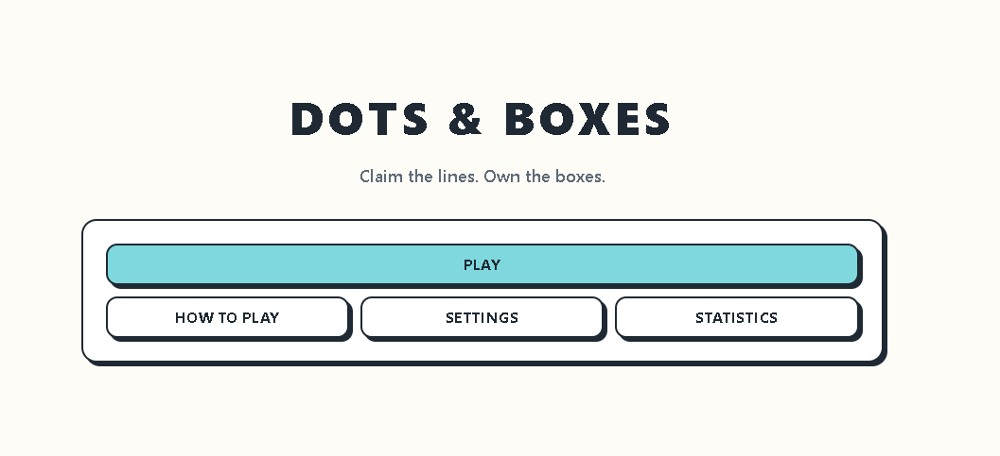

<div align="center">
    
    <br />
    <h1 align="center">
        
        Doxo
    </h1>

**A neo-brutalist take on the classic pen-and-paper game, built with React 19, Redux Toolkit, Tailwind CSS v4, and procedural Web Audio.**

[](https://bun.sh)
[](https://react.dev)
[](https://redux-toolkit.js.org)
[](https://www.typescriptlang.org)
[](https://tailwindcss.com)
[](LICENSE)

</div>

Doxo is a Dots & Boxes web game. Grab a friend and play on the same screen, or play against an AI that actually understands chain reactions instead of just picking random lines. The whole board is drawn with SVG so it scales cleanly on any screen. Sound effects are generated on the fly with the Web Audio API, so there are no audio files to load, and your stats and settings stick around between sessions.

## ✨ Features

- **Board that scales properly.** Cell size, dot radius, line thickness, and touch targets all adjust automatically depending on screen size, up to 960px, with no pixelation or jumpy layout.
- **AI with three real difficulty levels.** Easy just plays random moves. Medium grabs boxes when it can and avoids leaving easy 3-sided setups. Hard actually looks ahead at chain reactions to minimize how much it hands you.
- **Undo that goes back multiple turns.** There's a 120-state history you can walk back through, and it's smart enough to skip over the AI's own moves in single-player so you're not undoing twice.
- **Sound with zero audio files.** Every click, box-completion chord, win fanfare, and error beep is synthesized in the browser in real time.
- **Stats that persist.** Win rates, streaks, and total boxes claimed are tracked in Redux and saved to `localStorage` automatically.
- **Built to be usable.** High-contrast neo-brutalist look, haptic feedback on phones that support it, full keyboard controls, and a reduced-motion option.

## 🚀 Usage

### 1. Clone the repository
```bash
git clone https://github.com/sir-siren/doxo.git
cd doxo
```

### 2. Install dependencies
```bash
bun install
# or npm install / pnpm install
```

### 3. Start the dev server
```bash
bun run dev
```
Then open `http://localhost:5173` in your browser.

### 4. Build for production
```bash
bun run build
```

### 5. Run tests and lint
```bash
bun run test        # Vitest suite
bun run typecheck   # TypeScript compilation check
bun run lint        # Oxlint
```

## 🎮 Controls

| Input / Action | Interaction | Description |
| :--- | :--- | :--- |
| **Mouse / Touch** | Click or tap an edge line | Claims that line for the current player |
| **Keyboard Focus** | <kbd>Tab</kbd> / <kbd>Shift</kbd> + <kbd>Tab</kbd> | Moves focus between unclaimed edges on the board |
| **Keyboard Claim** | <kbd>Enter</kbd> or <kbd>Space</kbd> | Claims whichever edge is currently focused |
| **Undo** | Click the **Undo** button | Reverts the last turn (both moves in AI mode) |
| **Dot Click** | Click a grid dot | Does nothing gameplay-wise, just shows a quick error toast |

## 📊 Technical Specs & Constants

| Category | Constant / Setting | Default Value | Location |
| :--- | :--- | :--- | :--- |
| **Grid Bounds** | `BOARD_SIZE_MIN` / `BOARD_SIZE_MAX` | `3` / `8` rows & cols | `src/features/settings/state/settings.slice.ts` |
| **Board Geometry** | `MIN_CELL` / `MAX_BOARD` | `32px` / `960px` | `src/features/game/hooks/useGameBoard.ts` |
| **Hitbox Buffer** | `Math.max(32, strokeWidth + 24)` | $\ge 32\text{px}$ touch target | `src/features/game/components/BoardEdge.tsx` |
| **History Limit** | `MAX_UNDO_HISTORY` | `120` moves | `src/features/game/state/game.slice.ts` |
| **Storage Key** | `STORAGE_KEY` / `SCHEMA_VERSION` | `doxo:app-state` / `v1` | `src/shared/lib/persistence/storage.ts` |
| **AI Think Delay** | Turn timer delay | `600ms` | `src/pages/game-screen/GameScreen.tsx` |

## 🔧 Customization

If you want to tweak things yourself, here's where to look:

- **Board sizing and layout limits:** `src/features/game/hooks/useGameBoard.ts`
- **AI difficulty and strategy logic:** `src/features/ai/strategies/`
- **Sound effect frequencies and tone shaping:** `src/shared/lib/sound.ts`
- **Default game config (player names, board size, accessibility defaults):** `src/features/settings/state/settings.slice.ts`

## 📄 License

MIT licensed. See the [LICENSE](LICENSE) file for the details.

<div align="center">

 **If you enjoy it, a star on GitHub goes a long way.** ⭐

</div>
